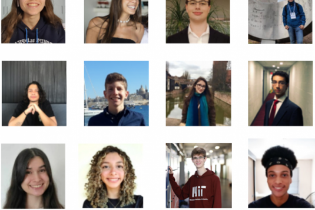

::: {.row}
  ::: {.column width="175"}
    
  :::
  ::: {.column width="500"}
    [Young Researcher award recipients of 2022](http://www.ccen.ufpb.br/ccen/contents/noticias/trabalhos-premiados-do-xxx-encontro-de-iniciacao-cientifica-via-propesq-ccen-ufpb)
  :::
:::

---

 [Fundação Estudar announces selected candidates for tech fellowship program](https://www.opovo.com.br/noticias/tecnologia/opovotecnologia/2022/09/10291358-fundacao-estudar-anuncia-agraciados-de-programa-focado-em-tecnologia.html)

---

 [Visit to the Brazilian Navy base and the Naval Systems Analysis Center](https://www.marinha.mil.br/casnav/?q=node/175)

---

 [UFPB students are awarded with the Best Undergraduate Work at Brazilian OR Conference](https://www.ufpb.br/ufpb/contents/noticias/alunos-da-ufpb-ganham-premio-de-iniciacao-cientifica-em-simposio-de-pesquisa-operacional)

---
