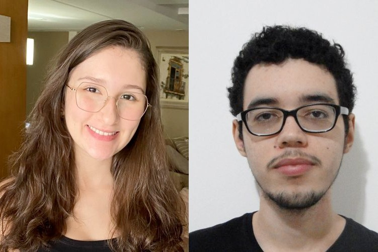

---

&nbsp;&nbsp;&nbsp;&nbsp;[Finalists for the 2024 INFORMS Undergraduate Operations Research Prize](https://www.informs.org/Recognizing-Excellence/Award-Recipients/Lara-Pontes)

---

&nbsp;&nbsp;&nbsp;&nbsp;[The Maximum Length Car Sequencing Problem presented to the 2024 INFORMS Undergraduate Operations Research Prize](https://www.linkedin.com/feed/update/urn:li:activity:7253870583589818369/)

---

&nbsp;&nbsp;&nbsp;&nbsp;[Young Researcher award recipients of 2022](http://www.ccen.ufpb.br/ccen/contents/noticias/trabalhos-premiados-do-xxx-encontro-de-iniciacao-cientifica-via-propesq-ccen-ufpb)

---

&nbsp;&nbsp;&nbsp;&nbsp;[Selected candidates for Fundação Estudar Tech Fellowship program](https://www.opovo.com.br/noticias/tecnologia/opovotecnologia/2022/09/10291358-fundacao-estudar-anuncia-agraciados-de-programa-focado-em-tecnologia.html)

---

&nbsp;&nbsp;&nbsp;&nbsp;[Visit to the Brazilian Navy base and the Naval Systems Analysis Center](https://www.marinha.mil.br/casnav/?q=node/175)

---

&nbsp;&nbsp;&nbsp;&nbsp;[Best Undergraduate Work at Brazilian OR Conference](https://www.ufpb.br/ufpb/contents/noticias/alunos-da-ufpb-ganham-premio-de-iniciacao-cientifica-em-simposio-de-pesquisa-operacional)

---
