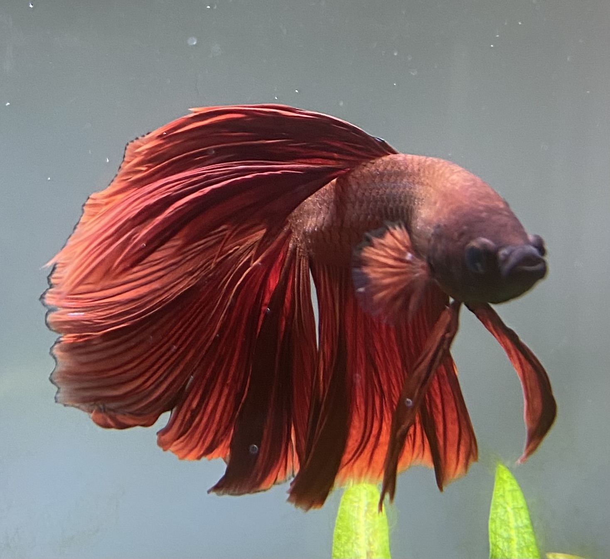
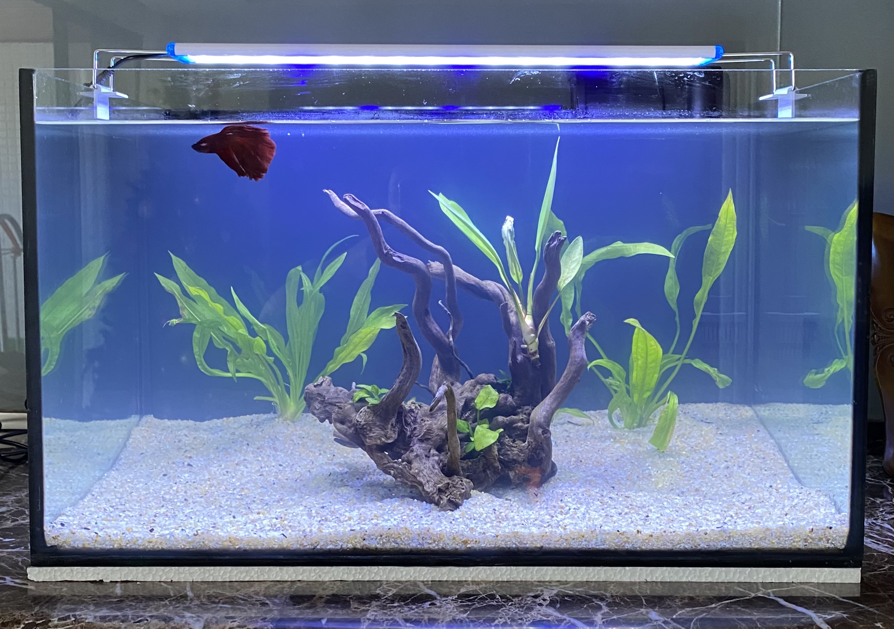

I am Brazilian, born in João Pessoa, where the easternmost point of the continental Americas is located at. For this reason, it is also known as "the city where the sun rises first". Here, we have beautiful beaches, a hot weather, and great food.

Alongside my parents, I have three sisters and three nieces. Being surrounded by women, including really young ones, fuels my passion to work towards a fairer world for us, especially in tech.

I have been interested in subjects such as mathematics, arts, reading and writing since my childhood. Growing up, I also started to be curious about physics, the universe and technology. I loved to participate in Knowledge Olympiads, because they allowed me to use creativity to solve complex problems. Nowadays, I can challenge myself in the same way while researching in the prescriptive analytics field.

Some of my hobbies include drawing, dancing, playing board games, watching TV series, and reading. Besides that, I take care of my fish tank, which is currently home for only one fish. His name is Pincel (the Portuguese for "brush"), since he is a Betta fish and looks like a red makeup brush.

<figure>

<figcaption><b>Fig. 1 - Pincel</b></figcaption>
</figure>

<figure>

<figcaption><b>Fig. 2 - Fish tank</b></figcaption>
</figure>
