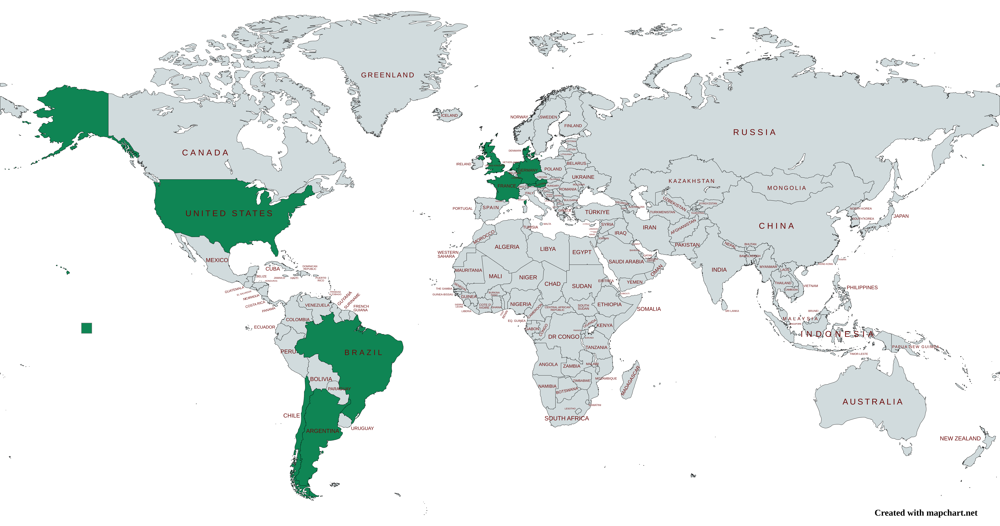

I am Brazilian, born in João Pessoa, where the easternmost point of the continental Americas is located at. For this reason, it is also known as "the city where the sun rises first". Here, we have beautiful beaches, hot weather, and great food.

Alongside my parents, I have three sisters and three nieces. Being surrounded by women, including really young ones, fuels my passion to work towards a fairer world for us, especially in tech.

I have been interested in subjects such as mathematics, reading and writing since my childhood. Growing up, I also started to be curious about physics, the universe, and technology. I was really excited to participate in Knowledge Olympiads because they allowed me to use creativity to solve complex problems. Nowadays, I can challenge myself in like manner while researching in the prescriptive analytics field.

Some of my hobbies include drawing, dancing, running (not very good in any of them), playing board games, watching TV series, and reading. In addition, I love to discover new places and cultures. Traveling to me is the opportunity to experience history, rather than hear about it, and understand on a deeper level different ways of living.

<figure>

<figcaption><b>Fig. 3 - My travels</b></figcaption>
</figure>
